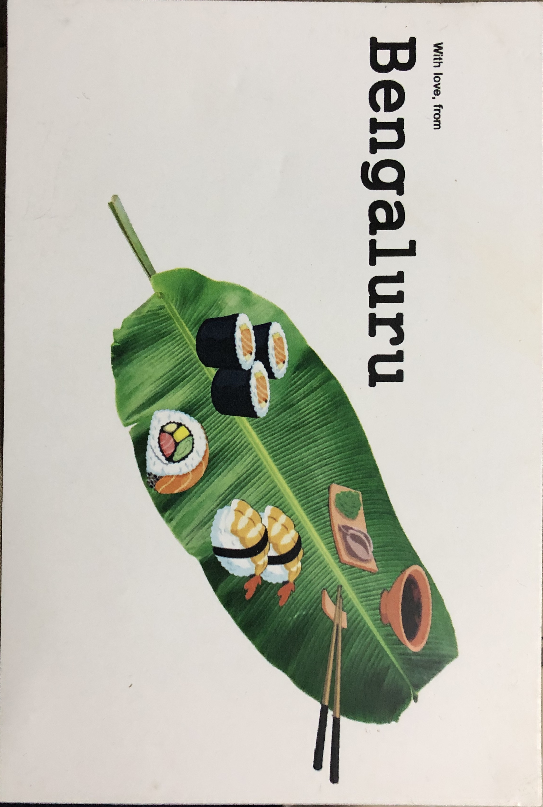

This is a 'diary entry' post about how I met someone for the first time, a year ago. The events leading up to that might be of some interest to you. One of them includes somebody having thought of me as possibly being a serial killer.

That last line was written in hopes of making you want to read more. Not clickbait, promise. Here's the story:

Sometime in February last year, Nikhil Taneja of '[Yuvaa]' came to my college. They were touring various colleges across India to talk about their initiative - a platform for the youth that emphasized the importance of sharing stories and giving people a safe space to do so. Nikhil first shared his life story and then invited others to talk if they wished. I liked their idea and got along with Nikhil right from the start. I also think it's important to share stories because that makes people who they are. I thought it would be nice to volunteer, and I talked for a bit too.

After that session, he told us about another initiative of theirs - Postcards of Kindness. We got a postcard from a random person who's written it from a place Yuvaa had been to before, and we got to take one if we wrote one back, and that would go to someone else in some other place Yuvaa would go. It's intended to be a small gesture to bring someone joy when they read it. I took one that had the person's Instagram handle written on the side, and I decided I'd do the same with my postcard, in hopes that whoever gets this would start a conversation with me.

This is the one I got! A great lad.

I wrote this postcard. Wasn't easy to think of something nice to write in 5 minutes.

A little about the postcard: I read a lot of postcards that were shared to people of our college, and the postcards they wrote. All of them can be summarized to a generic "I love you. You are doing great". I didn't want to do that, and I had explicitly told Nikhil that I wanted to think before writing, but since he was in a hurry to continue his road trip, I scribbled all that I wrote as you can see. The lines above, in some sense, were still 'okay okay,' because I did think that space wasn't enough given that much time to write also, and "share your story" and "be skeptical" is probably the most "Vineet" thing I could write in it. Then, I wrote the last two lines as a sort of an inside joke that Taneja laughed at, and I also left it at that.

What followed was something I could never expect. I got a response within a couple of days. A person from Bangalore messaged me. We got to talking and "shared our story". At this point, it was something like a 'pen friend', and I never knew I would have something like that because 'pen friend' was just a letter-writing exercise at school until then.

Around 2-3 weeks went by, and I was packing my bags to attend an internship recruitment process at Bangalore. Then it hit me - I could meet this new person! It seemed weird at first, thinking we've hardly talked, that too only on Instagram DMs, and now I wanted to ask her to hang out without sounding like a creep. Here's the part where apparently, her friend had thought that I could be a serial killer. And this wasn't the first time somebody thought that of me. Is it the beard? Or that I talk very freely? I don't know, but now I won't be surprised if someone else will think that of me if we start chatting online. Not sure if I want to have this first impression associated with me, because I am as harmless as one can be. Of course, I had to prove that wrong. That wasn't my primary motive anyway, just saying. She gladly accepted, and we met for dinner. I had a lot of fun that I met her again the next day. Now thanks to her, I know about a few good places to eat from over there! And she did a lovely thing and gave me a postcard in return too!

So wholesome, like our story.

Bangalore means more to me now than it did before.

This has to be one of the best ways I've made a friend and a very good one at it. Despite the fact that we just got to know each other, I can call her a really good friend, and I really cherish this friendship. I'm glad this postcard thing worked. Whenever we talk, and we have to tell the other about an event from our past, we prefix that with 'Story Time!' and go on to narrate it. I recently met her again after almost a year. I learned about another nice place to eat. We caught up after a year, and it didn't even feel like it had been a year since we last met.

This one was staged, of course. Did this one to share it with Taneja.

---

I felt like sharing this story because I thought it was interesting, the way we met. It's always very refreshing to meet new people and share stories with them and hear new stories and different perspectives. I think it's important to note that sharing stories is what makes people get closer, not necessarily the time you know the person for. Some of you might be familiar with talking to close friends late at night when for some reason you both feel more open to talk. Or, it might be that you're on a trip with some people, and you get close to them because of that. The common thing among all that, is that you're sharing your story with them, whether it's you narrating it to them or living it with them. Maybe we should learn to share stories more and more, and that's independent of what time it is, or where you are. There's so much to learn from stories. It gives you strength, hope, knowledge, and, most of all, great connections to cherish. Hit me up in the comments, or start a conversation with me if you'd like to do some Story Time!

[Yuvaa]: https://yuvaa.co.in/
